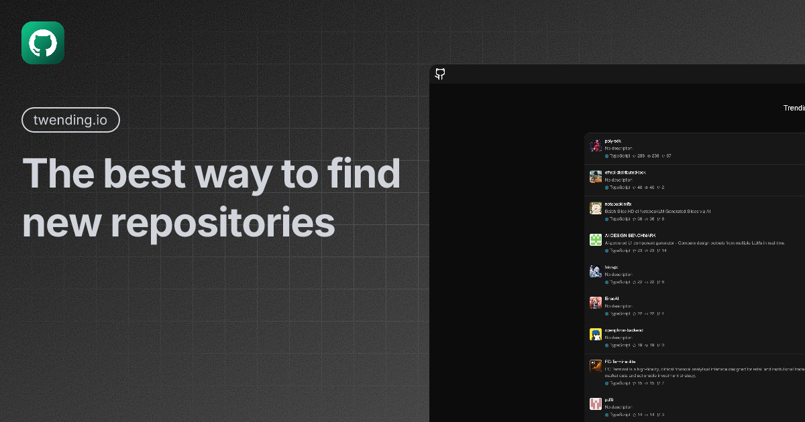

# Twending



Twending is a new way to view trending repositories from github.

## Features

- **TypeScript** - For type safety and improved developer experience
- **TanStack Start** - SSR framework with TanStack Router
- **TailwindCSS** - Utility-first CSS for rapid UI development
- **shadcn/ui** - Reusable UI components
- **tRPC** - End-to-end type-safe APIs

## Getting Started

First, install the dependencies:

```bash
pnpm install
```

Then, run the development server:

```bash
pnpm run dev
```

Open [http://localhost:3000](http://localhost:3000) in your browser to see the web application.

## Project Structure

```
twending/
├── apps/
│   └── web/         # Fullstack application (React + TanStack Start)
├── packages/
│   ├── api/         # API layer / business logic
```

## Available Scripts

- `pnpm run dev`: Start all applications in development mode
- `pnpm run build`: Build all applications
- `pnpm run check-types`: Check TypeScript types across all apps
- `pnpm run lint`: Lint all code
- `pnpm run lint:fix`: Fix lint errors
- `pnpm run format`: Format all code
