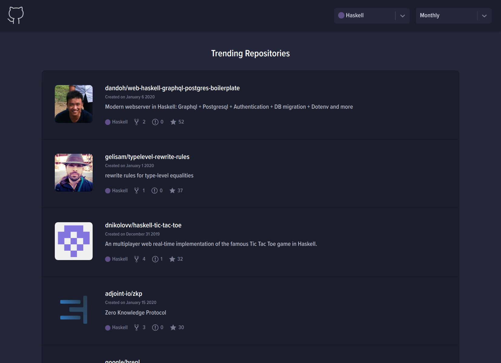

# Twending [](https://codechecks.io) [](https://codeclimate.com/github/Brettm12345/twending/maintainability)

Yet another github trending web application.

## Screenshot



## Development

To get started with development use these commands

```bash
git clone https://github.com/brettm12345/twending
yarn install
yarn dev
```
